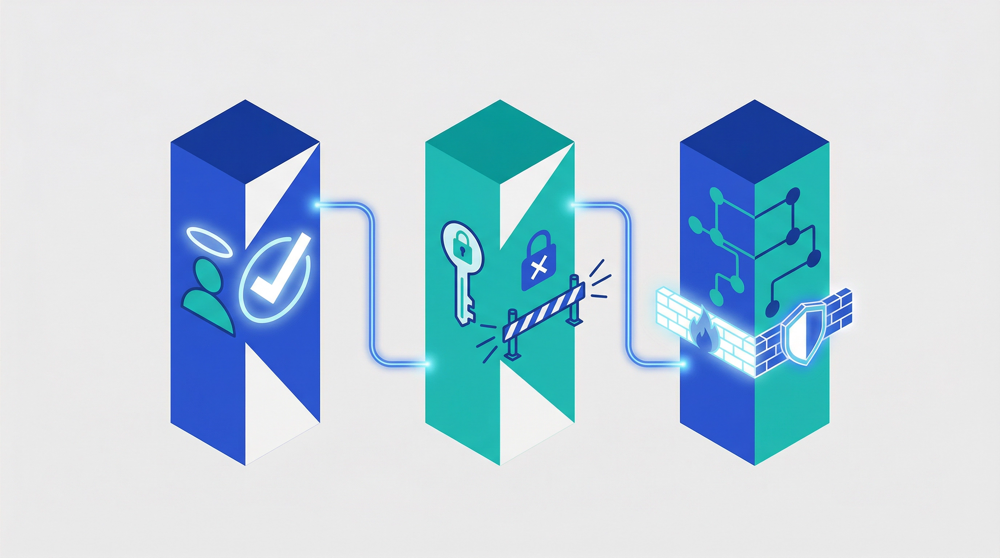

# Is Zero Trust the Answer? A Reality Check on Modern Cybersecurity

Zero Trust is more than a buzzword; it's a fundamental challenge to how we've always handled security. The model demands that we discard the old idea of a trusted internal network and instead treat every access request with suspicion. But how effective is this approach in the real world, and what are its limits?

Let's open the debate and explore the critical questions every organization should be asking.

---

## The Core Idea: Never Trust, Always Verify

Before we dive into the challenges, let's clarify what Zero Trust is. It is not a single product but a security strategy built on the principle that no user or device should be trusted by default, whether inside or outside the network. According to Microsoft, this approach is guided by three core principles:

**1. Verify Explicitly**

Always authenticate and authorize based on all available data points, including user identity, location, device health, and more.

**2. Use Least Privilege Access**

Grant users only the access they need, for only as long as they need it, using tools like Just-in-Time (JIT) and Just-Enough-Access (JEA).

**3. Assume Breach**

Minimize the potential damage from an attack by segmenting networks, encrypting traffic end-to-end, and using analytics to detect threats early.

---

## Is Zero Trust a Silver Bullet for Everyone?

Can any organization, regardless of its size or industry, successfully implement a Zero Trust Architecture (ZTA)? The data shows widespread adoption, with one 2025 report indicating that **81% of organizations** have already started their Zero Trust journey. However, adoption doesn't always equal success.

The reality is that implementation is complex. While large enterprises may have the resources to build a comprehensive ZTA, small and medium-sized businesses (SMBs) often face significant barriers, including high costs and a lack of specialized expertise. The question is not whether Zero Trust is universally applicable, but rather how organizations can tailor it to their specific context and capabilities.

---

## The Real-World Hurdles: Beyond the Hype

Why do so many organizations struggle with Zero Trust? The challenges are not just technical; they are deeply rooted in cost, complexity, and culture.

| Challenge Category | Key Obstacles | Supporting Data |
| :--- | :--- | :--- |
| **Cost & Complexity** | High implementation costs, interoperability issues with legacy systems, and a shortage of skilled security professionals. | Only 30% of SMBs have fully implemented ZTA due to cost and complexity. |
| **User Experience** | Strict security controls can lead to user frustration and reduced productivity if not implemented thoughtfully. | **37% of companies** report daily or weekly employee complaints about remote access and network security. |
| **Organizational Resistance** | Resistance from users accustomed to frictionless access and IT teams struggling to manage multiple, fragmented security tools. | **92% of companies** use more than one tool to manage network security, creating fragmentation and inefficiency. |

---

## Securing the Modern Workplace: Hybrid Work and BYOD

Zero Trust is particularly relevant in today's world of remote work and Bring Your Own Device (BYOD). By verifying the identity and security posture of every user and device before granting access, ZTA provides a robust framework for securing resources, no matter where they are accessed from.

Microsoft's own internal implementation of Zero Trust highlights the importance of enforcing device health and strong, phishing-resistant multi-factor authentication (MFA) for all access requests, especially in a hybrid environment. The key insight is that Zero Trust is not about restricting access—it's about enabling secure access anywhere. When implemented thoughtfully, it can actually improve the user experience by reducing friction and enabling seamless, secure connectivity.

---

## The Verdict: Is Zero Trust Worth It?

Zero Trust is not a simple, plug-and-play solution. It is a strategic commitment that requires careful planning, significant investment, and a cultural shift. While it may not be 100% foolproof, it provides a far more resilient security posture than traditional, perimeter-based models.

The key is to strike the right balance between security and usability. A successful Zero Trust strategy should be adaptive, risk-based, and as transparent to the end-user as possible. It is not just a destination but an ongoing journey of continuous improvement. Organizations should start with a clear assessment of their current security posture, identify the most critical assets to protect, and gradually expand their Zero Trust implementation over time.

---

## Let's Discuss: Your Perspective Matters

The debate around Zero Trust is far from over. Organizations worldwide are grappling with the same questions you might be asking:

- What does Zero Trust mean for you and your business?
- Are there viable alternatives that offer comparable security with less complexity?
- What tools and processes are critical for making Zero Trust a reality in your organization?
- How can you balance the need for security with the need for a seamless user experience?

Share your experiences, challenges, and insights. The more we learn from real-world implementations, the better we can guide organizations toward effective, sustainable security strategies.

---

## Ready to Simplify Your Security Strategy?

If navigating Zero Trust feels overwhelming, you're not alone. Many organizations struggle to balance security complexity with practical implementation. That's where we come in. We help small and medium-sized businesses design and implement security-first approaches using Microsoft 365, ensuring your organization is protected, scalable, and efficient.

**Ready to explore how Zero Trust can work for your organization?** Visit us at [https://easym365.de](https://easym365.de) to learn more about our security consulting and implementation services.

---

## Key Takeaways

- **Zero Trust is a strategy, not a product** – It requires a cultural shift and ongoing commitment
- **81% adoption rate** – Most organizations have started their Zero Trust journey, but challenges remain
- **SMBs face unique barriers** – Cost and complexity mean only 30% have fully implemented ZTA
- **User experience matters** – 37% of companies report employee complaints about security friction
- **Hybrid work demands Zero Trust** – Secure access from anywhere is essential in today's workplace
- **Start small, scale gradually** – Assess your current posture and expand implementation over time

---

## References

1. Microsoft. (2025, February 27). *What is Zero Trust?* Microsoft Learn. Retrieved from [https://learn.microsoft.com/en-us/security/zero-trust/zero-trust-overview](https://learn.microsoft.com/en-us/security/zero-trust/zero-trust-overview)

2. StrongDM. (2025, June 26). *The State of Zero Trust Security in the Cloud Report*. Retrieved from [https://www.strongdm.com/blog/state-of-zero-trust-security-cloud](https://www.strongdm.com/blog/state-of-zero-trust-security-cloud)

3. Tailscale. (2025). *The State of Zero Trust report 2025*. Retrieved from [https://tailscale.com/resources/report/zero-trust-report-2025](https://tailscale.com/resources/report/zero-trust-report-2025)

4. CyberRisk Alliance. (2024, January 19). *High Costs and Complexities Result in Only 30% of SMBs Fully Adopting Zero Trust*. Retrieved from [https://www.cyberriskalliance.com/press-release/cra-cbir-zero-trust](https://www.cyberriskalliance.com/press-release/cra-cbir-zero-trust)

5. Microsoft. (2025, April 24). *Implementing a Zero Trust security model at Microsoft*. Inside Track Blog. Retrieved from [https://www.microsoft.com/insidetrack/blog/implementing-a-zero-trust-security-model-at-microsoft/](https://www.microsoft.com/insidetrack/blog/implementing-a-zero-trust-security-model-at-microsoft/)

---

## About the Author

**Philipp Schmidt** is a Microsoft 365 security specialist helping small and medium-sized businesses implement secure, scalable, and simple cloud solutions. With expertise in Zero Trust architecture, identity management, and compliance frameworks, Philipp guides organizations through their digital transformation journey.

**Website:** [https://easym365.de](https://easym365.de)  
**Tagline:** "Secure. Scalable. Simple M365."
